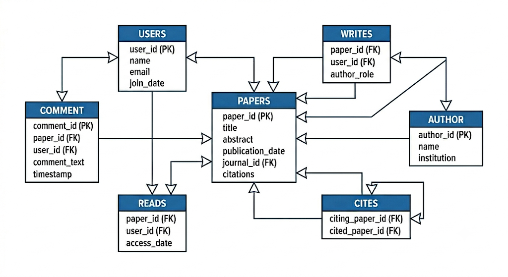

# ScholarForum Documentation

**ScholarForum** is an academic platform designed to combine the structured data retrieval of a research paper repository with the community interaction of a social discussion forum. Standard research platforms lock discussions away from the target material, whereas ScholarForum anchors academic discourse directly to specific publications and citation networks. It addresses the need for efficient paper discovery and transparent peer-to-peer feedback.

---

### Tech Stack

* **Frontend:** Built with **HTML5, CSS3, and Bootstrap 5** for responsive, standardized UI components. **JavaScript** handles asynchronous API requests (`fetch`/AJAX) without page refreshes.
* **Backend:** **Python 3.x** using the **Django Framework** (or **FastAPI**). Django manages routing, user session authentication, and object-relational mapping (ORM).
* **Database:** **PostgreSQL 15+** serving as the core relational database management system.

**Special Database Data Types & Indexing**
* **`tsvector`:** A specialized PostgreSQL data type representing a document normalized into a sorted list of distinct lexemes (root words) with stop-words removed. Used in the `Papers` table to combine titles and abstracts into a single searchable document.
* **`tsquery`:** Parses search queries into lexemes and logical operators (`&` for AND, `|` for OR, `!` for NOT) to match against a `tsvector`.
* **`GIN Index` (Generalized Inverted Index):** An inverted index created on `tsvector` columns that maps each individual word to matching row IDs. This enables sub-second keyword execution over thousands of rows without performing full table scans.

**APIs & Internal Endpoints**
* `GET /api/papers/search/?q={query}&year={year}&author={author}`: Executes Full-Text Search with filtering options.
* `GET /api/papers/{paper_id}/`: Fetches paper details along with metadata and citation links.
* `POST /api/comments/create/`: Submits a comment tied to a logged-in user and a target paper.
* `GET /api/papers/{paper_id}/citations/`: Fetches all citing and cited papers for a given publication.

---

### Database Schema



The relational schema consists of core entity tables, interaction tables, and junction tables designed to preserve data integrity and support complex research networks:

**Primary Entities**
* **`USERS`**: Stores user account details.
  * `user_id` (PK), `name`, `email`, `join_date`
* **`PAPERS`**: Stores metadata for indexed research papers.
  * `paper_id` (PK), `title`, `abstract`, `publication_date`, `journal_id` (FK), `citations`
* **`AUTHOR`**: Stores unique author profiles and academic affiliations.
  * `author_id` (PK), `name`, `institution`

**Junction & Interaction Tables**
* **`WRITES`**: Junction table mapping authors (or users) to written papers, defining contributor roles.
  * `paper_id` (FK), `user_id` (FK), `author_role`
* **`CITES`**: Self-referential junction table representing directed citation links between papers.
  * `citing_paper_id` (FK), `cited_paper_id` (FK)
* **`COMMENT`**: Stores user-submitted feedback tied to specific papers.
  * `comment_id` (PK), `paper_id` (FK), `user_id` (FK), `comment_text`, `timestamp`
* **`READS`**: Interaction table tracking reading history for analytics and recommendations.
  * `paper_id` (FK), `user_id` (FK), `access_date`

---

### Functionality & Implementation Architecture

**User Authentication & Authorization**
* **Mechanism:** Managed by Django's built-in authentication system.
* **Execution:** Encrypts user credentials using PBKDF2 with SHA-256 password hashing. Session IDs are generated and stored in browser cookies upon login, enforcing access controls on protected endpoints such as submitting comments.

**Full-Text Paper Search & Relevancy Ranking**
* **Mechanism:** Powered by PostgreSQL's `to_tsvector` and `to_tsquery` functions running over a GIN Index.
* **Execution:** When a search query is submitted, the backend converts the query text using `plainto_tsquery()` or `websearch_to_tsquery()`. It evaluates matches against the `search_vector` column using the `@@` match operator. Relevancy ordering is applied using `ts_rank()`, sorting papers by keyword density and frequency.

**Filtering by Metadata (e.g., Publication Year, Author)**
* **Mechanism:** Standard relational B-Tree index lookup.
* **Execution:** Extracted query parameters (such as `publish_date` range or `author_id`) are applied as `WHERE` clause conditions alongside the full-text search match (e.g., `WHERE search_vector @@ query AND EXTRACT(YEAR FROM publish_date) = 2024`).

**Citation Mapping (Who Cited Whom)**
* **Mechanism:** Self-referencing Many-to-Many relationship using a `Citations` junction table.
* **Execution:** A dedicated SQL table stores pairs of `citing_paper_id` and `cited_paper_id`, both serving as foreign keys referencing `Papers(paper_id)`. Executing a query for a given paper fetches incoming links (papers citing it) and outgoing links (papers it cites) through recursive or standard SQL joins.

**Flat Discussion System (Comments)**
* **Mechanism:** One-to-Many relational linking.
* **Execution:** Each comment entry in the `Comments` table contains mandatory Foreign Keys pointing to `user_id` and `paper_id`. When a paper detail page loads, the backend executes `SELECT * FROM Comments WHERE paper_id = :id ORDER BY created_at DESC`, retrieving discussion history without needing complex recursive tree traversals.
